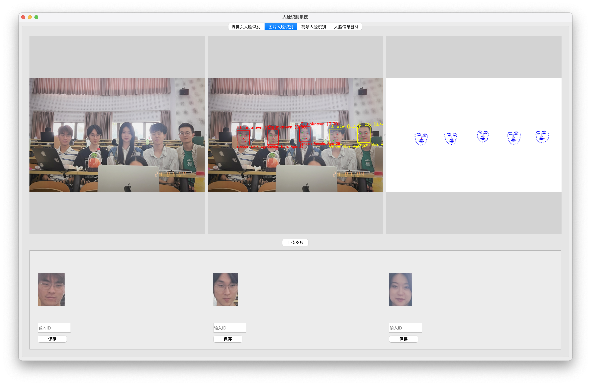
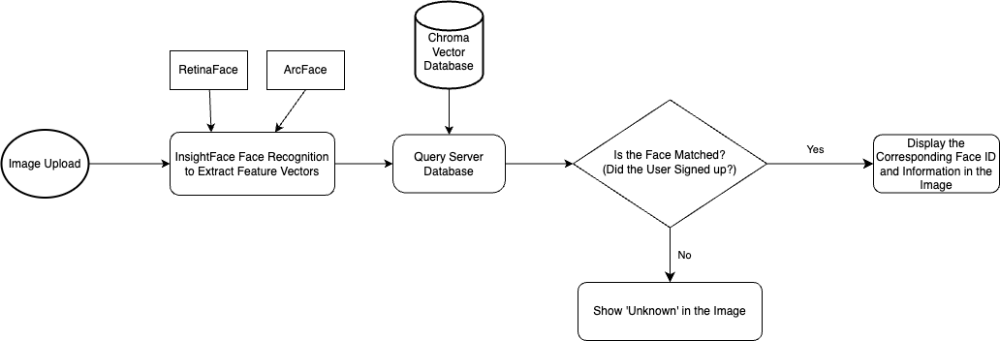

# Design & Build - Face Recognition System - Group 10

Visit [FacePerks](https://service.design-build.site) (https://service.design-build.site) to view the live demo and
explore its features.

To view the full project, please visit the following repositories:

- [Server (Backend) Code](https://github.com/Design-Build-Group-10/Server) (https://github.com/Design-Build-Group-10/Server)
- [Web Client (Frontend) Code](https://github.com/Design-Build-Group-10/Web-Client) (https://github.com/Design-Build-Group-10/Web-Client)
- [Upper and Lower Computer Code](https://github.com/Design-Build-Group-10/Lower-And-Upper-Computer) (https://github.com/Design-Build-Group-10/Lower-And-Upper-Computer)
- [Face Recognition Code](https://github.com/Design-Build-Group-10/FaceRecognition) (https://github.com/Design-Build-Group-10/FaceRecognition)

## Table of Contents

- [Design \& Build - Face Recognition System - Group 10](#design--build---face-recognition-system---group-10)
  - [Table of Contents](#table-of-contents)
  - [Abstract](#abstract)
- [FaceRecognition](#facerecognition)
  - [Introduction to the System](#introduction-to-the-system)
  - [Installation Guide](#installation-guide)
    - [System Requirements](#system-requirements)
    - [Installation Steps](#installation-steps)
  - [User Guide](#user-guide)
    - [Starting the Program](#starting-the-program)
    - [Functionality Modules](#functionality-modules)
      - [Real-time Camera Face Recognition](#real-time-camera-face-recognition)
      - [Image-based Face Recognition](#image-based-face-recognition)
      - [Video-based Face Recognition](#video-based-face-recognition)
      - [Facial Information Deletion](#facial-information-deletion)
  - [Troubleshooting](#troubleshooting)
    - [Program Fails to Start](#program-fails-to-start)
    - [Camera Not Detected](#camera-not-detected)
  - [Contact Support](#contact-support)
  - [System Functionality Description](#system-functionality-description)
    - [Image Acquisition and Transmission](#image-acquisition-and-transmission)
    - [Facial Detection and Recognition](#facial-detection-and-recognition)
      - [RetinaFace](#retinaface)
      - [ArcFace](#arcface)
    - [Database Management](#database-management)
      - [Deployment and Configuration](#deployment-and-configuration)
    - [Remote Data Synchronization and Storage](#remote-data-synchronization-and-storage)
      - [Database Integration](#database-integration)
      - [Data Storage Function](#data-storage-function)
    - [User Interaction Interface](#user-interaction-interface)
      - [Main Function Modules](#main-function-modules)
      - [Interaction Design](#interaction-design)
  - [System Design](#system-design)
    - [Image Capture Module](#image-capture-module)
    - [Facial Detection Module](#facial-detection-module)
    - [Database Management Module](#database-management-module)
    - [Remote Server Module](#remote-server-module)
    - [Frontend Display Module](#frontend-display-module)
  - [Core Algorithm Design](#core-algorithm-design)
    - [RetinaFace: Multi-stage Single-shot Facial Localization Algorithm](#retinaface-multi-stage-single-shot-facial-localization-algorithm)
      - [Algorithm Overview](#algorithm-overview)
      - [Network Structure and Feature Pyramid](#network-structure-and-feature-pyramid)
      - [Facial Detection and Keypoint Localization](#facial-detection-and-keypoint-localization)
      - [Data Augmentation and Preprocessing](#data-augmentation-and-preprocessing)
        - [Data Augmentation](#data-augmentation)
        - [Data Preprocessing](#data-preprocessing)
      - [3D Facial Reconstruction](#3d-facial-reconstruction)
      - [Loss Functions and Optimization Strategy](#loss-functions-and-optimization-strategy)
        - [Loss Functions](#loss-functions)
        - [Optimization Strategy](#optimization-strategy)
      - [Performance Evaluation and Comparison](#performance-evaluation-and-comparison)
        - [Performance Evaluation](#performance-evaluation)
        - [Comparison](#comparison)
    - [ArcFace: Additive Angular Margin Loss for Deep Face Recognition](#arcface-additive-angular-margin-loss-for-deep-face-recognition)
      - [Algorithm Overview](#algorithm-overview-1)
      - [Core Principle: Additive Angular Margin Loss](#core-principle-additive-angular-margin-loss)
      - [Mathematical Expression](#mathematical-expression)
      - [Features and Advantages](#features-and-advantages)
  - [System Implementation](#system-implementation)
    - [Detection Algorithm Implementation](#detection-algorithm-implementation)
      - [Using InsightFace for Facial Detection and Recognition](#using-insightface-for-facial-detection-and-recognition)
      - [Integration and Optimization](#integration-and-optimization)
        - [OpenCV - Processing Video and Image Frames](#opencv---processing-video-and-image-frames)
        - [InsightFace - Facial Detection and Feature Extraction](#insightface---facial-detection-and-feature-extraction)
    - [Database Management](#database-management-1)
      - [Chroma Database Integration and Configuration](#chroma-database-integration-and-configuration)
      - [Data Storage and Synchronization Process](#data-storage-and-synchronization-process)
      - [Data Query and Identity Verification](#data-query-and-identity-verification)
    - [Remote Detection Result Transmission](#remote-detection-result-transmission)
      - [Implementation Method](#implementation-method)
      - [Data Upload Process](#data-upload-process)
  - [Experiments](#experiments)
    - [Core Algorithm Evaluation](#core-algorithm-evaluation)
      - [Experimental Datasets](#experimental-datasets)
      - [Experimental Parameter Settings](#experimental-parameter-settings)
      - [Algorithm Performance and Problem Analysis](#algorithm-performance-and-problem-analysis)
    - [System Testing](#system-testing)
      - [Database Management Testing](#database-management-testing)
      - [Remote Detection Result Transmission Testing](#remote-detection-result-transmission-testing)
      - [Detection System Workflow and Result Display](#detection-system-workflow-and-result-display)
  - [Conclusion](#conclusion)
    - [System Advantages](#system-advantages)
    - [System Limitations](#system-limitations)
    - [Future Work](#future-work)
  - [References](#references)

## Abstract

This report details the design and implementation of a highly integrated facial recognition system. Using advanced image processing technologies and artificial intelligence algorithms, the system automates the entire process from image capture to feature analysis. Key features include real-time image acquisition, facial detection and recognition, data management, and remote data synchronization and storage. The system leverages the core algorithms of the InsightFace project—RetinaFace and ArcFace—to achieve high-precision and efficient facial recognition. Additionally, this report describes the system’s user interface design, core algorithm performance evaluation, and potential future improvements.

The project developed a facial recognition system with the following key features: real-time image acquisition via robot cameras, preprocessing, and WiFi transmission to the server to ensure efficient and reliable data transfer; facial detection using RetinaFace and feature extraction and recognition using ArcFace, providing high-accuracy results; using Chroma vector database to store and manage facial feature data, supporting efficient querying and retrieval; remote synchronization and backup of data via cloud storage to ensure data security and accessibility; a PyQt5-developed frontend interface that provides real-time facial recognition, image recognition, and video processing functionalities with a user-friendly experience.

The system uses two advanced facial recognition algorithms: RetinaFace for high-precision facial detection, combining multi-scale feature pyramids and anchor boxes to handle facial localization in various complex environments, and ArcFace for feature extraction optimized through additive angular margin loss, improving recognition accuracy and robustness.

The system achieves facial recognition by preprocessing images, using RetinaFace for multi-scale detection, ArcFace for extracting high-dimensional feature vectors, and cosine similarity or Euclidean distance for feature matching and identity verification. The Chroma vector database is used to store facial feature data, with API calls to manage data CRUD operations, ensuring data management flexibility and security.

Comprehensive experiments and testing were conducted on the system, including core algorithm performance evaluations and database management tests. The results showed that the system performed well in various complex scenarios, though improvements can be made in extreme environmental conditions.

By utilizing advanced algorithms and technologies, the system provides efficient and accurate facial recognition with good scalability and practicality. However, there are still areas for improvement in adaptability under extreme conditions and computational resource demands. Future work will focus on algorithm optimization, reducing computational resource needs, enhancing user interaction functions, and expanding application scenarios.

# FaceRecognition

## Introduction to the System

The **FaceRecognition** module leverages advanced image processing technologies to quickly detect and recognize faces from video streams, images, or real-time camera input. This system provides flexibility by supporting facial detection and recognition from various sources such as videos, images, and real-time cameras.

## Installation Guide

### System Requirements

- Operating Systems: Windows 10 or higher, macOS 10.15 or higher, Linux
- Python version 3.9 or higher
- Install the necessary dependencies using `requirements.txt`.

### Installation Steps

1. **Ensure Python Environment is Installed:**
   Ensure you have Python 3.9 or higher installed on your system.

2. **Install Dependencies:**
   Open the terminal and run the following command to install the necessary dependencies:

   ```bash
   pip install -r requirements.txt
   ```

3. **Optional: GPU Acceleration**
   If your system supports CUDA and you want to leverage GPU acceleration, install the CUDA-supported version of ONNX Runtime:

   ```bash
   pip install onnxruntime-gpu==1.10.0
   ```

---

## User Guide

### Starting the Program

1. **Navigate to the Program Directory:**
   Open your terminal or command prompt and navigate to the directory where the program is stored.

2. **Run the Main Program:**
   In the `src` directory, run the following command to start the system:

   ```bash
   python main_window.py
   ```

### Functionality Modules

#### Real-time Camera Face Recognition

In the "Camera Face Recognition" tab, click the start button. The system will automatically capture video from the connected camera and display real-time face recognition results.

#### Image-based Face Recognition

In the "Image Face Recognition" tab, click the upload button and select an image containing a face. The system will display recognition results and relevant information.

#### Video-based Face Recognition

In the "Video Face Recognition" tab, upload a video file. The system will analyze each frame of the video, detecting and marking faces.

#### Facial Information Deletion

In the "Face Information Deletion" tab, input the face ID you wish to remove, and click the delete button to remove the relevant data from the system.

## Troubleshooting

### Program Fails to Start

- **Check Dependencies**: Ensure that all required dependencies have been installed correctly.
- **Check for Syntax Errors or File Path Issues**: Verify the integrity of the code and ensure there are no syntax errors or incorrect file paths.

### Camera Not Detected

- **Verify Camera Connection**: Ensure that the camera is properly connected and recognized by the system.
- **Check for Access Permissions**: Verify that the program has permission to access the camera on your system.

---

## Contact Support

If you encounter technical issues or require assistance, please contact technical support through the following emails:
- **2022213670@bupt.cn**
- **2022213682@bupt.cn**

## System Functionality Description

The goal of this project is to develop a highly integrated facial recognition system using advanced image processing technologies and artificial intelligence algorithms, automating the entire process from image capture to feature analysis. The system’s key functions include real-time image acquisition, facial detection and recognition, data management, and remote data synchronization and storage. Below is a detailed description of each functional module.

### Image Acquisition and Transmission

The system’s first function is to capture real-time images using cameras mounted on robots or local cameras. Once captured, the robot’s built-in image processing unit performs preprocessing steps such as cropping, grayscaling, and noise filtering to improve the accuracy and efficiency of subsequent facial detection and recognition.

To enable real-time image transmission, we use Tencent Cloud Lightweight Application Server as the central node for data processing and storage. After capturing images, the robot’s built-in camera transmits the data in real-time to the server over a stable WiFi connection. To ensure transmission efficiency and reliability, we use an efficient data transmission protocol (HTTP) and implement data compression and error detection mechanisms to minimize transmission delays and data loss risks.

### Facial Detection and Recognition

The system’s facial detection and recognition functionality relies on InsightFace’s core algorithms, including RetinaFace and ArcFace. These algorithms provide the system with high-precision and high-efficiency facial recognition solutions.

#### RetinaFace

RetinaFace is a single-stage multi-level facial localization method designed to handle facial detection in uncontrolled environments. It integrates facial box prediction, 2D facial landmark localization, and 3D vertex regression into a common goal: point regression on the image plane. RetinaFace manually labels five facial landmarks on the WIDER FACE dataset and uses a semi-automatic labeling process to generate 3D vertices for facial images in the WIDER FACE, AFLW, and FDDB datasets, thus filling the data gap. These additional annotations support the reciprocal regression target of 3D face reconstruction, which predicts 3D vertices projected onto the image plane under a common 3D topological constraint. This method can easily integrate with the existing box and 2D landmark regression branches in parallel during joint training without optimization difficulties.

**Implementation**: After the image is transmitted to the server, the system first invokes the RetinaFace algorithm for facial detection. This algorithm marks the positions of faces in the image and generates bounding boxes that contain the facial regions.

#### ArcFace

ArcFace provides an additive angular margin loss for extracting highly discriminative facial recognition features. This method offers a clear geometric interpretation by accurately corresponding to the geodesic distance on a hypersphere. ArcFace has been extensively evaluated on more than ten facial recognition benchmarks, including new large-scale image and video datasets, consistently surpassing existing state-of-the-art technologies in performance, and is easy to implement with minimal computational overhead.

**Implementation**: After facial detection is completed, the system uses the ArcFace algorithm to extract features from each detected face. The extracted feature vectors are compared with known facial features in the database for identification. If recognized, the system returns the corresponding identity information; if not, the system records the unknown face’s features for further processing.

The combination of these two algorithms enables the system to achieve stable facial detection and precise 2D facial alignment and robust 3D facial reconstruction. The entire inference process is efficient and completed in a single pass. Additionally, InsightFace provides a wide range of pre-trained models and training codes, making it possible to implement these advanced facial recognition technologies in the project, significantly improving development efficiency and system performance.

### Database Management

Facial feature vectors and related information are stored in a Chroma vector database deployed on Tencent Cloud servers. Chroma is specifically designed for managing large amounts of vector data and supports efficient querying and retrieval. Deployed using Docker containers, Chroma provides services through port 8000, and data CRUD operations are implemented via API calls in the `chroma_client.py` script. This design not only ensures flexibility and scalability in data management but also ensures the system’s data security and privacy protection.

#### Deployment and Configuration

Chroma is deployed using Docker containers, ensuring consistent operation across different environments and simplifying deployment and management. With Docker, Chroma can be quickly migrated between different servers, enhancing the system’s elasticity and reliability. Regarding configuration, we provide services on port 8000 and use API interfaces to manage database operations. The `chroma_client.py` script efficiently handles data management through these APIs.

### Remote Data Synchronization and Storage

Our system’s remote data synchronization and storage function is implemented through the Chroma vector database, specifically designed for efficiently managing large volumes of vector data. The core function is to ensure that all facial images and their analysis results captured by the robot camera can be securely and reliably stored and managed.

#### Database Integration

The Chroma database is deployed on Tencent Cloud servers, providing a stable and scalable platform for data management. The database configuration allows the system to access and perform data operations, including addition, querying, updating, and deletion, securely over the network. The system’s database integration ensures flexible and efficient data operations.

1. **Stability and Scalability**: Tencent Cloud servers provide high availability and scalability, ensuring stable database operation under high loads, with elastic resource expansion as needed.
2. **Network Security**: Secure network protocols are used to transmit data, encrypting sensitive information to ensure its security during transmission.

#### Data Storage Function

Once the system recognizes a face through facial detection algorithms, the facial feature vectors and related metadata (such as user ID, gender, and age) are stored in the database. This functionality provides a robust data backup solution and supports complex data queries, such as identity verification and historical data retrieval.

1. **Feature Vector Storage**: Feature vectors are high-dimensional data, and the database is optimized for storing these vectors, ensuring storage and retrieval efficiency.
2. **Metadata Management**: Metadata (such as user ID) is stored alongside feature vectors, supporting multi-dimensional data queries and analysis.

### User Interaction Interface

Our system uses PyQt5 to develop a frontend interface specifically designed for validating facial recognition technology, providing a range of features including real-time facial recognition, image-based facial recognition, video processing, and the ability to delete facial information from the database.



#### Main Function Modules

1. **Real-time Camera Facial Recognition**:
   - Users can use a local camera for real-time facial recognition. The system will display the processed video stream and a 3D landmark image. The video stream includes facial detection results, such as facial information (e.g., name, identity), predicted age, predicted gender, and confidence. Users can also view unknown faces detected by the system and further operate on them (e.g., save or ignore). This module also supports a photo capture feature, allowing users to capture and save recognition results at any time.

2. **Image-based Facial Recognition**:
   - This feature allows users

 to upload images for facial recognition. The system processes the uploaded images and displays the original image, marked image, and 3D landmark image. Users can browse recognition results, including detailed information (such as name, age, and gender) for recognized faces and unknown faces. Users can choose to record this facial information into the database and add remarks and tags to each image for later retrieval and management.

3. **Video-based Facial Recognition**:
   - Users can upload video files for facial recognition processing. The system provides three video players to display the original video, the processed video, and the 3D landmark video, the latter two showing detection and recognition results. This module supports uploading, playing, pausing, fast-forwarding, slow-playing, and clearing videos, allowing users to analyze facial recognition results from multiple angles. Users can also review recognition results frame by frame, ensuring accuracy and completeness.

4. **Facial Information Deletion**:
   - To delete specific facial information from the system, users can enter the facial ID in this feature and perform a delete operation. The system provides a simple interface for entering IDs and confirms the deletion operation via a button, with results feedback through a dialog box. To prevent accidental deletion, the system also includes a secondary confirmation dialog, where users must confirm the deletion operation again. Deletion operations are logged for later review by system administrators.

#### Interaction Design

The interface design focuses on user experience, organizing all functions into tabs so users can easily switch between different function modules. Each functional area includes clear instructions and operation buttons, ensuring that even first-time users can quickly get started. For example, the image and video upload functions are equipped with progress bars and status information to help users understand the progress of their operations. The interface’s color scheme uses soft tones to prevent visual fatigue, and spacing and layout between modules are carefully designed to improve readability and operational convenience.

- **Navigation Bar**: The navigation bar at the top of the interface contains tabs for all major features, allowing users to switch to the desired function with a click.
- **Operation Tips**: Each functional area includes operation tips and instructions to guide users through operations.
- **Status Feedback**: All operations provide real-time status feedback, such as progress bars during image and video uploads, and pop-up notifications after recognition processing is completed.
- **User-friendly Design**: The interface supports drag-and-drop functionality, allowing users to directly drag images or videos into the specified area for uploading. All buttons and input fields are designed to match user habits, improving operational efficiency.

With its carefully designed user interface and rich functionality, our system provides users with a smooth and intuitive experience while ensuring the efficiency and accuracy of the facial recognition process.

## System Design

The system provides a comprehensive facial recognition solution, covering the entire process from image capture to data management and result display. The following is a detailed introduction to the design and functionality of each major module.



### Image Capture Module

The image capture module is the system’s entry point, responsible for acquiring images from the local camera or the robot’s camera in real time. It can capture high-quality video streams stably under various lighting conditions.

### Facial Detection Module

The facial detection module is based on the InsightFace library, an advanced open-source 2D and 3D facial analysis toolbox that supports multiple facial recognition technologies, such as RetinaFace and ArcFace. This module first uses RetinaFace for facial localization and feature point detection. The facial regions detected are standardized and input into the ArcFace algorithm to extract facial feature vectors for subsequent facial recognition and verification. ArcFace leverages the powerful learning capabilities of deep neural networks to extract high-dimensional, high-discriminative feature vectors from large-scale facial datasets, enabling excellent facial recognition performance.

### Database Management Module

The database management module uses the Chroma vector database to store and manage captured facial data. Chroma is designed for efficiently managing large-scale vector data and supports fast data insertion, querying, and updating. This module stores not only facial feature vectors but also manages related metadata such as recognition time, location, and possible user IDs. To improve query efficiency, we optimized the database with indexing and employed parallel processing techniques, significantly enhancing query speed on large datasets. Additionally, the database management module supports data backup and recovery, ensuring the security and integrity of the data.

### Remote Server Module

The remote server module ensures that all data is processed and stored locally and uploaded to cloud storage for backup and further processing. This module uses secure and reliable network connections to achieve real-time data synchronization and encrypted transmission, ensuring the security of the data during transmission. The use of cloud storage not only enhances the security and reliability of the data but also provides the system with powerful computing resources to support parallel processing of large-scale data and training of deep learning models. Through the remote server module, users can access system data on different devices, enabling cross-platform data sharing and collaboration.

### Frontend Display Module

The frontend display module is responsible for presenting detection results and related information to users. This module, developed using PyQt5, provides an intuitive and user-friendly interface. The user interface includes real-time video stream display, detection result display, historical data query interface, and user interaction functions. Users can view the images captured by the camera and the processed video stream in real time. The system automatically marks and displays recognition results when faces are detected. The frontend display module also supports users uploading images or videos for offline recognition, querying and managing facial information in the database, and offering multiple interaction functions, such as bulk deletion and data export. To enhance user experience, we adopted responsive design, ensuring that the interface displays well on different devices and screen sizes.

## Core Algorithm Design

We employed two highly efficient and cutting-edge facial recognition technologies: InsightFace’s ArcFace and RetinaFace algorithms. These algorithms have demonstrated outstanding performance in both academic and industrial settings, particularly in large-scale data processing and facial recognition tasks in complex environments.

**ArcFace** is an innovative facial recognition technology whose core feature is the introduction of Additive Angular Margin Loss. This method enhances the discrimination ability of deep learning models in facial recognition tasks by optimizing the angular margin between feature vectors and class center vectors.

ArcFace is designed to optimize the inter-class margin by directly optimizing the angular margin in the feature space, making the features of the same class more compact while those of different classes are significantly separated, greatly improving the accuracy and robustness of facial recognition.

**RetinaFace** focuses on facial detection and excels at locating faces and detecting key points in uncontrolled environments. It uses a unified multi-task learning framework to detect faces and precisely locate facial landmarks, including eyes, nose, and mouth, and can perform 3D face reconstruction. RetinaFace’s efficiency and accuracy make it ideal for processing real-time video streams or large-scale image datasets.

### RetinaFace: Multi-stage Single-shot Facial Localization Algorithm

#### Algorithm Overview

RetinaFace is a high-performance single-shot multi-stage facial localization method aimed at accurately detecting faces and locating 2D and 3D facial key points in wild environments. The algorithm was proposed by Jiankang Deng et al. at the 2020 CVPR conference, addressing the challenges of facial detection and keypoint localization in complex environments. The core of RetinaFace lies in its unified network structure, which simultaneously completes facial detection and key point detection tasks through multi-task learning.

#### Network Structure and Feature Pyramid

The network structure of RetinaFace is based on Feature Pyramid Network (FPN) and ResNet. This combination leverages both deep and shallow features, improving the algorithm’s ability to recognize faces of different scales. The FPN fuses multi-scale features, providing rich semantic information at each scale, enabling the algorithm to effectively handle faces from small to large sizes.

The network gradually integrates high-level semantic features from deep layers with detailed features from shallow layers, constructing a multi-level feature pyramid. Each layer’s feature map contains not only features at its scale but also integrates features from other layers, enhancing the feature map’s representational power, thus improving the accuracy and robustness of facial detection.

#### Facial Detection and Keypoint Localization

RetinaFace’s facial detection uses an anchor-based method. The network predicts facial bounding boxes and confidence on different feature maps. This process involves generating multi-scale anchor boxes to match faces of different sizes. For facial keypoint localization, the algorithm predicts not only 2D key points but also the relevant coordinates for 3D facial shapes. This is achieved through an additional 3D vertex regression branch, which can predict the 3D structure of the face, facilitating subsequent facial analysis and recognition applications.

During facial detection, RetinaFace generates multiple anchor boxes and uses them to predict the location and confidence of facial bounding boxes. This ensures high-precision detection results for faces of various sizes and poses.

For keypoint localization, RetinaFace locates not only the five main facial landmarks (eyes, nose, mouth corners) but also recognizes more facial key points. This allows the algorithm to maintain high accuracy even when dealing with complex conditions such as facial expression changes, occlusions, and lighting variations.

#### Data Augmentation and Preprocessing

##### Data Augmentation

RetinaFace uses various data augmentation techniques to improve the model’s generalization ability. The data augmentation methods include:

1. **Random Cropping**: Randomly crops the input image to simulate different perspectives and scales.
2. **Random Flipping**: Horizontally flips the image to increase sample diversity.
3. **Color Jittering**: Adjusts the image’s brightness, contrast, and saturation to handle different lighting conditions.
4. **Rotation and Scaling**: Randomly rotates and scales the image to better adapt the model to faces of various poses and scales.

##### Data Preprocessing

During training, input images are normalized by scaling the pixel values to the [-1, 1] range. This helps accelerate model convergence and improves training stability.

#### 3D Facial Reconstruction

Another notable feature of RetinaFace is 3D facial reconstruction. By predicting the 3

D coordinates of each facial keypoint, the algorithm provides not only the positions of key points on the 2D plane but also depth information for the face. This is essential for advanced functionalities like facial expression analysis and dynamic facial recognition. The availability of 3D information allows RetinaFace to be applied to augmented reality (AR), virtual reality (VR), and other technologies requiring precise facial models.

#### Loss Functions and Optimization Strategy

##### Loss Functions

RetinaFace uses a multi-task loss function that includes:

1. **Classification Loss**: Used to differentiate between facial and non-facial regions.
2. **Bounding Box Regression Loss**: Used to precisely locate the facial bounding box, employing the Smooth L1 Loss.
3. **Keypoint Localization Loss**: Used to predict the position of facial key points, employing the Euclidean Distance Loss.
4. **3D Vertex Regression Loss**: Used for predicting the face’s 3D structure.

##### Optimization Strategy

RetinaFace’s training process uses the Adam optimizer, which features adaptive learning rate adjustment to accelerate model convergence. Additionally, a learning rate scheduling strategy is used to dynamically adjust the learning rate based on the training epochs, achieving better training results.

#### Performance Evaluation and Comparison

##### Performance Evaluation

RetinaFace’s performance has been evaluated on multiple public datasets, including WIDER FACE, AFLW, and FDDB. The evaluation metrics mainly include:

1. **Detection Accuracy**: Measures the model’s facial detection accuracy on different datasets.
2. **Keypoint Localization Precision**: Measures the model’s accuracy in the facial landmark detection task.
3. **Speed and Efficiency**: Evaluates the model’s inference speed and computational efficiency, usually measured in frames per second (FPS).

##### Comparison

Compared to other facial detection algorithms (such as MTCNN, DSFD, and SSH), RetinaFace demonstrates significant advantages in detection accuracy and keypoint localization precision. It shows greater robustness and practicality, particularly in handling complex environments and various scales of faces.

### ArcFace: Additive Angular Margin Loss for Deep Face Recognition

#### Algorithm Overview

ArcFace is a novel facial recognition technology introduced by Jiankang Deng et al. Its main innovation lies in the introduction of Additive Angular Margin into the loss function to enhance the discriminative power of deep convolutional neural networks (DCNN) in facial recognition tasks. This algorithm is particularly suitable for handling open-set facial recognition problems, where the model must deal with unseen facial images outside the training set. ArcFace has demonstrated excellent performance in many facial recognition benchmarks and is widely applied in real-world scenarios.

#### Core Principle: Additive Angular Margin Loss

The core of ArcFace is its Additive Angular Margin Loss, which is based on the traditional Softmax loss. In traditional Softmax loss, the model learns to map features of different classes in different directions. However, this method does not always guarantee sufficient separation between classes, affecting the accuracy and robustness of facial recognition.

ArcFace introduces a margin in the target class’s angle, making the features of the same class more compact and the angles between different classes larger. This significantly improves the inter-class separability in the feature space.

#### Mathematical Expression

ArcFace modifies the decision boundary in the Softmax formula by adjusting the angle margin between class centers to increase class separability. Specifically, for each training sample $x_i$ with label $y_i$, the traditional Softmax loss can be expressed as:

$$
L = -\frac{1}{N} \sum_{i=1}^N \log \frac{e^{W_{y_i}^T x_i + b_{y_i}}}{\sum_{j=1}^C e^{W_j^T x_i + b_j}}
$$

where $W_j$ and $b_j$ are the weight and bias parameters, and $C$ is the number of classes. ArcFace introduces an angular margin $m$, adjusting the formula to:

$$
L = -\frac{1}{N} \sum_{i=1}^N \log \frac{e^{s (\cos(\theta_{y_i} + m))}}{e^{s (\cos(\theta_{y_i} + m))} + \sum_{j \neq y_i} e^{s \cos \theta_j}}
$$

where $\theta_{y_i}$ is the angle between feature $x_i$ and its corresponding class weight $W_{y_i}$, and $s$ is the scaling factor.

#### Features and Advantages

- **Intuitive**: ArcFace directly optimizes the angular margin, making the features of the same class more compact and the boundaries between different classes more distinct. This optimization is more intuitive and physically meaningful in the feature space.
- **Efficient**: Compared to other methods, ArcFace adds very little computational complexity while significantly improving facial recognition performance. Its simple and effective design makes it easy to implement on various hardware platforms.
- **Robust**: By introducing angular margin during training, ArcFace demonstrates high robustness to label noise and variations in training sample quality. This allows the model to maintain high recognition accuracy when dealing with data of varying quality and sources.
- **Wide Applicability**: ArcFace has been proven to achieve or exceed state-of-the-art performance on multiple facial recognition benchmark datasets, including large-scale image and video datasets. Its wide applicability makes ArcFace an important tool in facial recognition.
- **Compatibility**: ArcFace can be seamlessly integrated with existing deep learning frameworks and facial recognition systems, making it suitable for various real-world applications such as identity verification, security surveillance, and smart photo albums.

## System Implementation

### Detection Algorithm Implementation

The implementation of detection algorithms is one of the core parts of the project. We use the InsightFace library, which integrates multiple facial recognition technologies, including RetinaFace for facial detection and ArcFace for facial recognition. Below is a detailed description of how we use the InsightFace library to implement facial detection and feature extraction from images.

#### Using InsightFace for Facial Detection and Recognition

1. **Image Preprocessing**:
   - **Size Adjustment**: To improve detection speed and accuracy, we resize all input images to a unified size. This ensures that the model works with consistent input formats, reducing processing complexity due to differences in image size.
   - **Normalization**: The pixel values of the image are normalized to the range of 0 to 1, which helps enhance model training performance and improves detection stability during inference.
   - **Color Adjustment**: Depending on the need, the image is converted to grayscale or retained in RGB mode to suit different detection requirements.

2. **Facial Detection**:
   - **Model Selection**: We selected the RetinaFace model, which balances accuracy and speed. RetinaFace not only detects the location of faces but also outputs facial key points (such as the positions of the eyes, nose, and mouth), providing more accurate localization for subsequent feature extraction.
   - **Multi-scale Detection**: To ensure accurate detection of faces of different sizes and poses, we implemented multi-scale detection techniques. By detecting faces at different scales, the robustness of detection is improved.

3. **Feature Extraction**:
   - **Model Training**: We use the ArcFace model for feature extraction. The model introduces additive angular margin loss during training, ensuring that features extracted from different images of the same person are consistent, while features of different people are more distinguishable.
   - **High-dimensional Feature Vectors**: The ArcFace model outputs high-dimensional feature vectors. These vectors have strong discriminative power in high-dimensional space. Each facial feature vector represents the unique biometric characteristics of the individual, enabling precise identity recognition and verification.

4. **Feature Matching and Recognition**:
   - **Feature Library Construction**: During system initialization, we built a database containing known facial feature vectors. Each feature vector corresponds to a unique identity.
   - **Similarity Calculation**: For the input facial features, we use cosine similarity or Euclidean distance metrics to match the input feature vector with those in the database. The higher the similarity, the more similar the input face is to a known face in the database.
   - **Recognition Result Feedback**: Based on the similarity calculation results, the system can return the recognized identity or indicate that the face is unrecognized, along with a confidence score.

#### Integration and Optimization

##### OpenCV - Processing Video and Image Frames

```python
cv2.rectangle(frame, (bbox[0], bbox[1]), (bbox[2], bbox[3]), color, 2) 
cv2.putText(frame, f'ID: {identity_str} ({confidence:.2f})', (bbox[0], bbox[1] - 10), cv2.FONT_HERSHEY_SIMPLEX, 0.9, color, 2)
cv2.putText(frame, f'Gender: {gender}, Age: {int(age)}', (bbox[0], bbox[3] + 20), cv2.FONT_HERSHEY_SIMPLEX, 0.7, color, 2)

cap = cv2.VideoCapture(0)

self.image = cv2.imread(file_name)

cap = cv2.VideoCapture(video_file)

fps = cap.get(cv2.CAP_PROP_FPS)
width = int(cap.get(cv2.CAP_PROP_FRAME_WIDTH))
height = int(cap.get(cv2.CAP_PROP_FRAME_HEIGHT))
frame_count = int(cap.get(cv2.CAP_PROP_FRAME_COUNT))

fourcc = cv2.VideoWriter_fourcc(*'mp4v')
label_video_out = cv2.VideoWriter('processed_video/processed_video.mp4', fourcc, fps, (width, height))
whiteboard_video_out = cv2.VideoWriter('processed_video/whiteboard_video.mp4', fourcc, fps, (width, height))

rgb_image = cv2.cvtColor(cv_img, cv2.COLOR_BGR2RGB)
```

##### InsightFace - Facial Detection and Feature Extraction

```python
faceAnalysis = FaceAnalysis(providers=['CUDAExecutionProvider', '

CPUExecutionProvider'])

faces = faceAnalysis.get(frame) 
whiteboard = faceAnalysis.draw_on(whiteboard, faces) 

frame = faceAnalysis.draw_on_dots(frame, faces)
```

The entire facial detection and recognition process is integrated into a unified system, where users can upload images or videos via the frontend interface. The system automatically detects and recognizes faces, and then returns the results to the user. We have optimized the algorithms and models in multiple rounds to ensure the system can meet real-time processing requirements while maintaining high accuracy.

### Database Management

In our system, facial feature vectors and related information are stored in the Chroma vector database deployed on Tencent Cloud servers. Chroma is specifically designed for efficiently managing large amounts of vector data, supporting fast data insertion, querying, and updating. Below is a detailed technical implementation and process description:

#### Chroma Database Integration and Configuration

The system first establishes data management through Chroma, deployed on Tencent Cloud servers. We run the Chroma service using Docker containers on the server and expose port 8000 to receive remote connection requests from the `chroma_client.py` script. The following code snippet shows how the database connection and collection initialization are performed:

```python
import chromadb

CHROMA_SERVICE_HOST = '82.156.184.46'
CHROMA_SERVER_PORT = 8000

client = chromadb.HttpClient(host=CHROMA_SERVICE_HOST, port=CHROMA_SERVER_PORT)

collection_name = "face_collection"
collection_exists = any(col.name == collection_name for col in client.list_collections())

if not collection_exists:
    client.create_collection(collection_name)
face_collection = client.get_collection(collection_name)
```

This code is responsible for establishing a connection with the Chroma database and checking if the required collection exists. If it doesn’t exist, a new collection is created.

#### Data Storage and Synchronization Process

When the system captures facial images through the robot camera, the `chroma_client.py` script calls the facial detection and recognition algorithms to process these images and extract facial feature vectors. These vectors, along with related metadata (such as user ID, gender, and age), are serialized and stored in the Chroma database. Below is the core code for storing facial data:

```python
def save_to_chroma(user_id, embedding):
    serialized_embedding = embedding
    face_collection.add(embeddings=[serialized_embedding], metadatas=[{'user_id': user_id}], ids=[user_id])
```

This function is responsible for adding the extracted facial feature vectors and related metadata to the database, achieving persistent data storage. The storage process ensures each user’s uniqueness by using the user ID as an identifier, effectively managing and retrieving user information.

#### Data Query and Identity Verification

When facial data needs to be verified or queried, the system can retrieve the closest match by sending a query request to the Chroma database. Below is the implementation code for querying and identity verification:

```python
results = face_collection.query(query_embeddings=[embedding], n_results=1)
if results['ids'] and results['ids'][0]:
    nearest_id = results['ids'][0][0]
    min_dist = results['distances'][0][0]
    identity = nearest_id if min_dist < 1.0 else 'unknown'
```

This code snippet determines the most likely identity match by comparing the similarity of feature vectors. If the matching distance is below the set threshold, the identity is confirmed. This method efficiently handles identity verification while ensuring system robustness under different conditions.

### Remote Detection Result Transmission

#### Implementation Method

By using the Chroma vector database to efficiently manage detected facial data, every time RetinaFace and ArcFace algorithms recognize and process one or more faces, the relevant facial images and feature vectors are stored in the server’s Chroma vector database.

#### Data Upload Process

1. **Data Preparation**: Retrieves the required data from the Chroma database, including facial images, related feature vectors, timestamps, location information (if available), and more. This step ensures that all necessary data is correctly extracted and ready for subsequent processing.
2. **Data Serialization**: The retrieved data is serialized for network transmission. Serialization converts complex data structures or object states into standard formats (such as JSON or XML), ensuring the data’s structure and integrity during network transmission. We use the JSON format for serialization because it is easy to read and parse and is compatible with most programming languages and network protocols.
3. **Server Reception and Storage**: The code connects to the Docker-deployed Chroma vector database on the server, then transmits the acquired facial feature vectors and ID information, which Chroma stores. Chroma supports high-frequency read/write operations to facilitate fast data access and processing, while also ensuring the security and reliability of the data.

## Experiments

### Core Algorithm Evaluation

#### Experimental Datasets

The evaluation of the system relies mainly on several well-established facial recognition benchmark datasets, including LFW (Labeled Faces in the Wild), CelebA, WIDER FACE, and MegaFace. These datasets provide an effective testing platform for facial detection and recognition algorithms under different environments and conditions. The LFW dataset is known for its diverse scenes and real-world images, suitable for validating the generalization ability of algorithms; CelebA provides rich facial attribute labels, aiding in evaluating the accuracy of facial feature extraction; WIDER FACE contains a large number of faces in complex scenes, making it ideal for testing the robustness of detection algorithms; MegaFace is renowned for its massive image library and challenging test set, suitable for evaluating the performance of algorithms on large-scale data.

#### Experimental Parameter Settings

In the experiments, we adjusted key parameters such as learning rate, batch size, and the number of training iterations to optimize model performance. Specifically, the learning rate started at 0.001 and was gradually reduced to fine-tune the training process; the batch size was set to 32 to balance training efficiency and computational resource usage; the number of iterations was adjusted based on the dataset size to ensure the model fully learned the data features. We also tuned regularization parameters and optimizer choices to prevent overfitting and enhance the model’s generalization ability. Additionally, cross-validation and grid search methods were used to further refine hyperparameter selection for optimal model performance.

#### Algorithm Performance and Problem Analysis

ArcFace and RetinaFace performed exceptionally well on the datasets mentioned above, demonstrating high-accuracy facial recognition and keypoint detection capabilities. The validation accuracy on the LFW dataset reached 99.8%, and the detection accuracy on the WIDER FACE dataset exceeded 90%. However, both algorithms showed room for improvement in extreme lighting and facial occlusion conditions. Detection accuracy decreased in low-light and high dynamic range scenes. Furthermore, during ArcFace training, we paid special attention to its robustness when faced with noisy real-world data, introducing a sub-center strategy to enhance the model’s performance in noisy environments. The sub-center strategy increases additional center points in feature space, improving classification accuracy when handling high-noise and variance data.

### System Testing

#### Database Management Testing

We conducted comprehensive tests on the system’s Chroma vector database, verifying its response speed and stability during real-time queries and data updates. The tests included query response time under high concurrency scenarios, performance under simultaneous multi-user access, and retrieval efficiency after large-scale data insertion and deletion operations. The results showed that the Chroma database maintained millisecond-level query response times when handling millions of data points, demonstrating excellent scalability and stability.

#### Remote Detection Result Transmission Testing

The system’s remote data transmission functionality was tested under various network environments to verify its data transmission efficiency and stability under limited bandwidth conditions. The test scenarios included large-scale data transmission in high-bandwidth environments, small data packet transmission in low-bandwidth and high-latency networks, and data recovery capabilities in unstable network environments. Experimental results showed that the system could transmit data in near real-time in high-bandwidth environments. In low-bandwidth and high-latency environments, by using data compression and optimized transmission protocols, the system maintained high transmission efficiency.

#### Detection System Workflow and Result Display

Through live demonstrations, we showcased the system’s entire workflow from receiving images to completing facial detection and recognition. The system could process input images in real-time and accurately display detection and recognition results. The demonstration included real-time video stream capture via camera, facial detection and recognition by the system, and result display through the user interface. The system maintained stable detection and recognition performance under various lighting conditions and demonstrated good adaptability to multiple facial expressions and pose changes. Furthermore, we showcased the system’s deployment and operation on different hardware platforms, demonstrating its excellent cross-platform compatibility and practical application value.

## Conclusion

### System Advantages

This system uses advanced ArcFace and RetinaFace algorithms, providing high-precision and real-time facial recognition services. These algorithms excel in feature extraction and matching, ensuring the system’s reliability and accuracy in various complex scenarios. Additionally, the system’s design is highly scalable, capable of handling future function expansions and optimizations. For example, new biometric recognition features such as fingerprint or iris recognition can be easily added through a modular design, enhancing the system’s multimodal recognition capabilities. The system also adopts a distributed architecture, supporting large-scale deployment and meeting the needs of various enterprises and institutions.

### System Limitations

Although the system performs well in many aspects, some limitations remain. First, the system’s adaptability in extreme environmental conditions needs improvement, particularly in low light, backlight, and partial facial occlusion conditions, where recognition accuracy decreases. Secondly, the system’s computational resource demand is relatively high, especially when processing large-scale datasets, which may affect real-time performance and user experience. Furthermore, the current system’s user interface and interaction functions need further optimization to better meet the needs of different user groups.

### Future Work

To address the limitations mentioned above, we plan to improve and expand the system in the following areas:

1. **Algorithm Optimization**: Further optimize the ArcFace and RetinaFace algorithms to improve the system’s robustness and recognition accuracy under various environmental conditions. Specific measures include introducing more

 advanced deep learning techniques and enhancing the diversity of the dataset to improve the system’s performance in low light and partially occluded face scenarios.
2. **Reduce Computational Resource Demand**: Explore more efficient data processing technologies, such as edge computing and model compression techniques, to reduce the system’s reliance on high-performance computing resources, thus improving deployment flexibility and operational efficiency.
3. **Enhance User Interaction Functions**: Add more user interaction features, such as voice control and gesture recognition, to improve user experience and system automation. Meanwhile, optimize the user interface design to make it more intuitive and easy to operate, attracting more users and feedback.
4. **Security and Privacy Protection**: Introduce stricter data encryption and privacy protection mechanisms into the system to ensure the security and privacy of user data and enhance user trust in the system.
5. **Expand Application Scenarios**: Explore the system’s application in other fields, such as smart cities, intelligent security, and personalized services, expanding the system’s application range and market potential.

## References

[1] X. Ren, A. Lattas, B. Gecer, J. Deng, C. Ma, and X. Yang, "Facial Geometric Detail Recovery via Implicit Representation," in 2023 IEEE 17th International Conference on Automatic Face and Gesture Recognition (FG), 2023.

[2] J. Guo, J. Deng, A. Lattas, and S. Zafeiriou, "Sample and Computation Redistribution for Efficient Face Detection," arXiv preprint arXiv:2105.04714, 2021.

[3] B. Gecer, J. Deng, and S. Zafeiriou, "OSTeC: One-Shot Texture Completion," in Proceedings of the IEEE/CVF Conference on Computer Vision and Pattern Recognition (CVPR), 2021.

[4] X. An, X. Zhu, Y. Xiao, L. Wu, M. Zhang, Y. Gao, B. Qin, D. Zhang, and Y. Fu, "Partial FC: Training 10 Million Identities on a Single Machine," Arxiv 2010.05222, 2020.

[5] J. Deng, J. Guo, T. Liu, M. Gong, and S. Zafeiriou, "Sub-center ArcFace: Boosting Face Recognition by Large-scale Noisy Web Faces," in Proceedings of the IEEE European Conference on Computer Vision, 2020.

[6] J. Deng, J. Guo, E. Ververas, I. Kotsia, and S. Zafeiriou, "RetinaFace: Single-Shot Multi-Level Face Localisation in the Wild," in CVPR, 2020.

[7] J. Guo, J. Deng, N. Xue, and S. Zafeiriou, "Stacked Dense U-Nets with Dual Transformers for Robust Face Alignment," in BMVC, 2018.

[8] J. Deng, A. Roussos, G. Chrysos, E. Ververas, I. Kotsia, J. Shen, and S. Zafeiriou, "The Menpo Benchmark for Multi-pose 2D and 3D Facial Landmark Localisation and Tracking," IJCV, 2018.

[9] J. Deng, J. Guo, N. Xue, and S. Zafeiriou, "ArcFace: Additive Angular Margin Loss for Deep Face Recognition," in CVPR, 2019.
